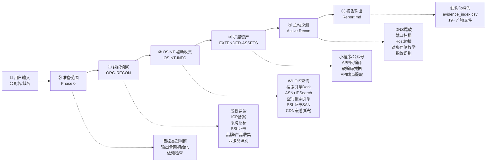
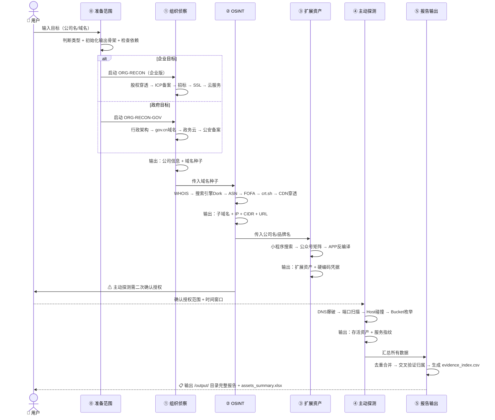

# Red-ICS — 企业资产智能侦察系统

<p align="center">
  <a href="https://github.com/ctfd3219/red-ICS/releases"></a>
  
  
  
  
  
  <a href="LICENSE"></a>
</p>

> **一句话**：输入一个公司名，全自动完成 Phase 0 准备 → 组织侦察 → OSINT 被动收集 → 扩展资产 → 主动探测 → 资产报告生成，支持 3 种授权模式和被动/主动资产分离保存。
> **核心理念**：消灭信息收集中的机械重复操作 —— 原本手动操作 10+ 个平台、执行 50+ 条命令、人工整理数小时的工作，由技能自动编排完成。

---

## 目录

- [为什么需要 Red-ICS？](#为什么需要-red-ics)
- [核心能力](#核心能力)
- [架构设计](#架构设计)
- [项目结构](#项目结构)
- [快速开始](#快速开始)
- [六大阶段深度解析](#六大阶段深度解析)
- [知识库内容](#知识库内容)
- [实战场景](#实战场景)
- [目标类型自动判断](#目标类型自动判断)
- [设计哲学](#设计哲学)
- [路线图](#路线图)
- [贡献指南](#贡献指南)
- [许可证](#许可证)

---

## 为什么需要 Red-ICS？

传统红队前期侦察存在三个核心痛点：

| 痛点 | 传统方式 | Red-ICS 解决方案 |
|------|---------|------------------|
| **平台碎片化** | 手动切换 10+ 平台（天眼查、ICP备案、FOFA、crt.sh、搜索引擎...） | **一站式编排** — 5 阶段流水线自动串联，各平台结果交叉验证 |
| **信息孤岛** | 股权穿透、子域名、端口、APP 反编译各自独立，无法关联 | **关联图谱** — 股权→子公司→备案域名→IP段→端口，全链条追溯 |
| **机械重复** | 每个目标重复执行相同命令序列，数小时低效劳动 | **一键启动** — 输入公司名，其余全部自动化，人工仅做决策和验证 |
| **覆盖盲区** | 忽略小程序、公众号、APP、采购招标、供应链等攻击面 | **360° 覆盖** — 组织 + OSINT + 扩展资产 + 主动探测，不留死角 |
| **报告耗时** | 数据收集后还需 2-3 小时整理报告 | **自动填入** — 所有数据汇入结构化报告模板，即产即用 |

---

## 核心能力

### 组织级穿透
从单一公司名出发，逐层穿透股权结构 → 控股子公司 → 参股公司 → 同一法人关联 → 分支机构。对政府目标自动切换行政架构穿透模式（上下级/直属/挂靠）。

### 三级授权模式
根据授权情况自动选择最强适用模式：`authorized`（全链路，被动→主动）、`passive-first`（授权不明时先被动，主动前确认）、`supplement`（基于已有数据补充采集 + 交叉核验）。

### 被动优先，零痕迹
前三个阶段（组织侦察 → OSINT → 扩展资产）全程零痕迹，所有数据来自搜索引擎缓存、SSL 证书透明日志、WHOIS 数据库、ICP 备案公示等第三方公开源，不与目标直接交互。

### CDN 穿透六法
自动判断是否使用 CDN，触发 6 种穿透方法：DNS 历史解析 → 子域名分站 IP → SPF 记录 → SSL 证书反查 → 邮件头分析 → 国外 DNS 解析，按成功率排序优先执行。

### 双模式自动切换
输入企业名 → 走企业版（股权穿透 + ICP 备案 + 商业云识别）。输入政府/事业单位名 → 走政府版（行政架构穿透 + gov.cn 域名体系 + 政务云识别 + 公安备案筛查）。

### 结构化交付
产出 `Report.md` 完整侦察报告 + `scope.json` + `company_info.json` + `evidence_index.csv` + `assets_summary.xlsx` + `domains_all.txt` + `ips_all.txt` + `ports_open.csv` + `host_collision.csv` + `credentials_found.json` 等 19+ 个结构化文件，被动/主动资产分离保存，全链条可追溯。

---

## 架构设计

Red-ICS 实现覆盖企业资产侦察全生命周期的 **6 阶段流水线**：



### 六大阶段一览

| # | 阶段 | 参考文档 | 核心输出 | 交互模式 |
|---|------|---------|---------|---------|
| 0 | **准备范围** | 自动 | scope.json、domains_seed.txt、输出骨架 | 本地检查 |
| 1 | **组织侦察** | `ORG-RECON.md` | 股权图谱、ICP域名、品牌清单、云服务商 | 零痕迹，第三方公开源 |
| 2 | **OSINT 被动收集** | `OSINT-INFO.md` | WHOIS 信息、子域名、CIDR 段、空间引擎结果、真实源站 IP | 零痕迹，搜索引擎+SSL日志 |
| 3 | **扩展资产** | `EXTENDED-ASSETS.md` | 小程序列表、公众号矩阵、APP API 端点、硬编码凭据 | 零痕迹为主，APP 下载可选 |
| 4 | **主动探测** | `Active Recon.md` | DNS 爆破、开放端口、Host 碰撞结果、Bucket 公开状态 | ⚠ 需完整授权 |
| 5 | **报告输出** | `Report.md` | 完整侦察报告 + 15+ 结构化数据文件 | 自动化填入 |

### 执行时序



---

## 项目结构

```
red-ICS/
├── SKILL.md                    # 技能主定义 — Agent 执行规则书（流程编排、授权控制、
│                               #    输出契约、字段规范、失败处理、完成标准）
├── README.md                   # 本文件
├── CHANGELOG.md                # 版本更新日志
├── config.json                 # 集中配置（默认输出、执行模式、资产状态、
│                               #    可信度等级、阶段名称、assets_summary.xlsx 表头）
│
├── scripts/                    # 辅助脚本
│   ├── init_output.py          #   初始化 output/ 目录骨架（CSV表头/JSON空文件/
│   │                           #     scope.json/Report.stub/assets_summary.xlsx 模板）
│   └── ipsearch_mcp_plan.py   #   IPSearch-MCP 固定调用计划生成器
│                               #    （IPv4 ip_lookup + 多组 keyword_lookup）
│
├── examples/                   # 典型调用示例
│   ├── authorized-full-chain.md       # 完整授权全链路执行
│   ├── passive-first.md               # 授权不明确时被动优先
│   └── supplement-existing-data.md    # 已有数据补充采集 + 交叉核验
│
├── references/                 # 参考流程文档（约 4,700 行）
│   ├── ORG-RECON.md            # ① 组织侦察（企业版）
│   │                           #    股权穿透 5 层级、品牌收集、ICP 备案 6 策略、
│   │                           #    采购招标挖掘、SSL 证书分析、云服务识别
│   │
│   ├── ORG-RECON-GOV.md        # ① 组织侦察（政府/事业单位专项版）
│   │                           #    行政架构穿透 5 层级、gov.cn 域名体系、
│   │                           #    公安备案筛查、政务云识别、信息公开挖掘
│   │
│   ├── OSINT-INFO.md           # ② OSINT 被动收集
│   │                           #    WHOIS 查询、Bing/Baidu/Google Dork（子域名+URL+
│   │                           #    身份证/手机/学号/工号/邮箱社工信息）、ASN+IPSearch、
│   │                           #    FOFA/Hunter/Quake 空间搜索引擎、SSL 证书 SAN、
│   │                           #    CDN 穿透 6 种方法（含完整命令）
│   │
│   ├── EXTENDED-ASSETS.md      # ③ 扩展资产
│   │                           #    微信/支付宝/百度/抖音小程序发现与反编译、
│   │                           #    公众号矩阵收集、Android/iOS APP 反编译、
│   │                           #    硬编码凭据提取（API Key/Token/密码/OSS地址）
│   │
│   ├── Active Recon.md         # ④ 主动探测
│   │                           #    DNS 爆破（OneForAll/Subfinder）、端口扫描（Nmap/Masscan）、
│   │                           #    CDN 穿透验证、Host 碰撞、对象存储枚举（OSS/COS/S3）、
│   │                           #    端口指纹识别（httpx/WhatWeb/wafw00f/nuclei）
│   │
│   └── Report.md               # ⑤ 报告模板
│                               #    完整侦察报告模板（组织结构化 + 域名IP + 端口服务 +
│                               #    扩展资产 + 凭据清单 + 供应链 + 云服务），
│                               #    自动变量替换，即产即用
│
└── output/                     # 运行时产物（gitignore 排除）
```

---

## 快速开始

### 环境要求

| 工具 | 用途 | 必要性 |
|------|------|--------|
| N/A（纯 Skill，无需代码安装） | 技能加载执行 | 必选 |
| `IPSearch-MCP` + `ip.db` | IP 归属反查组织 CIDR 段 | 必需（约 89MB，自动下载） |
| `FOFA-MCP` + API Key | 空间搜索引擎查询 | 强烈推荐（`npx` 自动拉取，需账号） |
| `kali-mcp` | WHOIS 查询 | 可选（不可用时回退在线平台） |

### 安装与配置

```bash
# 1. 克隆仓库
git clone https://github.com/ctfd3219/red-ICS.git

# 2. 部署到 opencode skills 目录
# Windows PowerShell:
Copy-Item -Recurse -LiteralPath "red-ICS" "$env:USERPROFILE\.config\opencode\skills\red-ICS"

# macOS/Linux:
cp -r red-ICS ~/.config/opencode/skills/red-ICS
```

**首次启动时自动执行**：
1. 检测操作系统 + 架构 → 匹配对应 `IPSearch` 可执行文件
2. 从 GitHub Release 下载 `IPSearch` 二进制 + `ip.db` 数据库（~89MB）
3. 解压 `ip.db` 到同目录，清理安装包

**手动配置 FOFA（推荐）**：

编辑 `~/.config/opencode/opencode.json`：

```json
{
  "mcp": {
    "fofa": {
      "type": "local",
      "command": ["npx", "-y", "fofa-mcp-server"],
      "enabled": true,
      "env": {
        "FOFA_EMAIL": "your@email.com",
        "FOFA_KEY": "your-api-key"
      }
    }
  }
}
```

> FOFA Key 获取：登录 https://fofa.info → 个人中心 → API 管理

### 使用方式

在对话中输入目标即可触发：

```
帮我收集 XX科技有限公司 的资产信息
```

```
对 example.com 做一次完整的资产侦察
```

```
对 XX市XX局 做红队前期侦察（政府单位）
```

> 技能自动判断目标类型（企业/政府/通用），选择对应流程执行。

### 输出目录

```
项目目录/output/
├── Report.md                    # 最终侦察报告（模板变量自动填入）
├── scope.json                   # 目标范围、授权边界、执行假设
├── evidence_index.csv           # 证据总索引（artifact/item/source/evidence/confidence/phase）
├── assets_summary.xlsx          # 人工汇总模板（14 列：组织/域名/子域名/.../主动探测）
├── company_info.json            # 公司基础信息 + 股权穿透
├── domains_seed.txt             # 阶段 1 输出的种子域名
├── domains_all.txt              # 全部域名（去重）
├── related_orgs.csv             # 关联组织清单
├── subdomains_passive.txt       # 被动发现子域名
├── subdomains_active.txt        # 主动发现子域名
├── subdomains_all.txt           # 全部子域名（合并去重）
├── ips_passive.txt              # 被动发现 IP
├── ips_active.txt               # 主动发现 IP
├── ips_all.txt                  # 全部 IP（去重）
├── cidrs_all.txt                # 全部 CIDR 段（去重）
├── urls_web.txt                 # 全部 Web URL
├── ports_open.csv               # 开放端口清单 (IP,Port,Service,Version)
├── host_collision.csv           # Host 碰撞命中结果
├── buckets_public.csv           # 公开 Bucket 清单
├── sensitive_files.txt          # 发现的敏感文件 URL
├── credentials_found.json       # 硬编码凭据清单
├── internal_hosts.txt           # 内部域名/IP 泄露
├── vendors_partners.csv         # 供应商/合作商清单
├── cloud_services.csv           # 云服务识别结果
└── logs/                        # 各阶段执行日志
    ├── scope.log
    ├── phase0_prepare.log
    ├── phase1_org_recon.log
    ├── phase2_passive_osint.log
    ├── phase3_extended_assets.log
    ├── phase4_active_recon.log
    └── phase5_report.log
```

---

## 六大阶段深度解析

### 阶段零：准备范围 — 目标解析与环境就绪

**目标**：解析目标类型，初始化输出骨架，检查依赖可用性。

- **目标类型判断**：企业 / 政府事业单位 / 纯域名目标
- **初始化输出骨架**：`init_output.py` 自动创建 `output/` 目录、CSV 表头、JSON 空文件、`scope.json` 和 `assets_summary.xlsx` 模板
- **依赖检查**：MCP Server、本地工具、API Key 可用性检查，缺口记录

### 阶段一：组织侦察 — 构建商业/行政关系图谱

**目标**：从一个公司名出发，通过工商公开数据构建完整的企业或政府单位关系网络。

**核心能力**：

- **5 层股权穿透**：目标公司 → 股东/投资方 → 对外投资（≥50% 控股子公司★重点标记）→ 分支机构 → 同一法人/董监高关联
- **ICP 备案 6 策略**：公司全称精确查 → 简称/曾用名模糊查 → 子公司逐一查 → 备案号反查 → 域名反查 → 邮箱/电话反查
- **采购招标挖掘**：从招标公告提取内部系统名称、技术栈、供应商清单，构建供应链攻击面
- **品牌/产品收集**：官网+招聘JD+应用商店+公众号+商标/专利 → 发现独立域名、APP名称、小程序 AppID
- **云服务商识别**：DNS CNAME 特征库（29 个已知后缀）+ HTTP 响应头特征 + MX/SPF 邮件服务判断
- **政府版专项**：行政架构穿透替代股权穿透、gov.cn 域名体系、公安备案筛查、政务云识别（华为云/浪潮/曙光等）

### 阶段二：OSINT 被动收集 — 零痕迹互联网资产发现

**目标**：通过第三方公开数据源，在不与目标直接交互的前提下，获取域名、IP、URL、端口等互联网资产。

**六步链**：

| 步骤 | 方法 | 数据源 | 产出 |
|------|------|--------|------|
| WHOIS | 域名注册信息查询 | kali-mcp / whois.aliyun.com / lookup.icann.org | 注册人、邮箱、DNS、关联域名 |
| 搜索引擎 Dork | Bing/Baidu/Google 高级语法 | 搜索引擎缓存索引 | 子域名、URL、敏感文件、社工信息（身份证/手机/工号/邮箱） |
| ASN + IPSearch | 组织 IP CIDR 段反查 | IPSearch-MCP (ip.db) / bgpview.io / ipip.net | 组织拥有的所有 IP 段、地理位置、运营商 |
| 空间搜索引擎 | 域名/证书/ICP/组织名搜索 | FOFA / Hunter / Quake | IP:端口列表、URL、页面标题、技术栈 |
| SSL 证书 SAN | 证书透明日志 + 证书反查 | crt.sh / certspotter | 同证书所有域名、内部域名、通配符证书 |
| CDN 穿透 | 6 种方法获取源站真实 IP | SecurityTrails / VirusTotal / SPF / 子域名 / 邮件 / 国外DNS | 真实源站 IP |

**CDN 穿透完整策略矩阵**（按优先级排列）：

| 优先级 | 方法 | 原理 | 成功率 | 零痕迹 |
|--------|------|------|--------|--------|
| ★★★★★ | 子域名/分站 IP | mail/api/dev 等子域名通常不配置 CDN | 最高 | ✅ |
| ★★★★☆ | DNS 历史解析 | 历史记录中可能保留未挂 CDN 时期的真实 IP | 高 | ✅ |
| ★★★★☆ | SPF 记录 | 发件服务器 IP 不经过 CDN | 高 | ✅ |
| ★★★☆☆ | SSL 证书反查 | 同证书关联域名中可能有未挂 CDN 的 | 中 | ✅ |
| ★★★☆☆ | 国外 DNS 解析 | 国内 CDN 无海外节点，直接回源 | 中 | ✅ |
| ★★★☆☆ | 邮件头分析 | 触发注册/找回密码邮件，邮件源码暴露源 IP | 中 | ⚠ 需交互 |
| ★★★☆☆ | FOFA/Shodan 特征搜索 | 通过 favicon 哈希、页面标题、特征字符串反查 | 中 | ✅ |

### 阶段三：扩展资产 — 小程序/公众号/APP 全收集

**目标**：发现 Web 资产之外的小程序、公众号和移动 APP，通过反编译提取 API 端点、硬编码凭据和内部域名。

- **四平台小程序搜索**：微信、支付宝、百度、抖音/头条
- **公众号矩阵**：公司全称/简称/品牌名/子公司名搜索 → 公众号菜单 URL → 认证主体确认
- **Android APK 反编译**：jadx/apktool 反编译 → 提取 strings.xml → 正则匹配 API 端点、硬编码密钥、OSS Bucket 地址、内部域名
- **iOS IPA 分析**：Info.plist 提取 Bundle ID/URL Schemes → 二进制字符串搜索

### 阶段四：主动探测 — 实时存活验证与隐藏资产发现

> ⚠ **此阶段需完整书面授权，执行前必须确认授权范围、配置速率限制、操作 IP 加入白名单**

- **DNS 爆破**：OneForAll（国内首选，模块最全）+ Subfinder（多源补充）→ puredns 高精度解析 + 泛解析过滤
- **端口扫描**：Nmap `-sS -sV`（服务版本识别）+ Masscan（C 段快速全端口）→ 按高危程度三级分类（RCE→弱口令→中间件）
- **Host 碰撞**：遍历子域名列表 × Web IP → 发现隐藏虚拟主机站点（内部 OA/ERP/运维系统）
- **对象存储枚举**：阿里云 OSS / 腾讯云 COS / AWS S3 / 华为云 OBS / 七牛 Kodo → 公开 Bucket 内容探测
- **指纹识别**：httpx（Web 存活 + 技术栈）+ WhatWeb/Wappalyzer（CMS识别）+ wafw00f（WAF检测）+ nuclei（技术栈模板）

### 阶段五：报告输出 — 结构化资产清单交付

所有阶段数据汇总 → 去重合并 → 多维度交叉验证归属 → 自动填入 `Report.md` 模板：

- **公司基础信息与组织架构**（含股权穿透表格）
- **域名与 IP 资产**（ICP 备案 + 子域名 + IP 段 + Web URL）
- **端口与服务**（开放端口清单 + 高危端口标注 + 指纹识别详情）
- **扩展资产**（小程序 + 公众号 + APP 分析）
- **供应链与合作伙伴**（采购招标提取的供应商 + 云服务商 + 邮件服务商）
- **敏感信息**（硬编码凭据 + 内部域名泄露 + 敏感文件 URL）

---

## 知识库内容

`references/` 目录包含约 4,400 行的企业资产侦察知识库，专为 AI 代理自主消费而设计。

### `references/ORG-RECON.md` (498 行)

完整的企业组织侦察方法论：
- **股权穿透 5 层级**：目标公司 → 股东 → 对外投资 → 分支机构 → 关联关系
- **控股子公司提取规则**（持股 ≥ 50%）：10 个核心字段（企业全称、信用代码、法人、域名、电话、邮箱、软著、招投标信息等）
- **ICP 备案 6 种查询策略**：官方渠道 → 爱企查 → 站长之家 → 备案号反查 → 域名反查 → 邮箱/电话反查
- **品牌/产品名 8 种来源**：官网、招聘、年报、新闻、应用商店、公众号、商标/专利、WHOIS
- **采购招标挖掘链**：采购公告 → 中标方 → 供应商中标的其他项目 → 关联公司 → 源码仓库泄露风险
- **SSL 证书字段价值**：Subject CN、SAN、Issuer、Organization、有效期、序列号反查
- **云服务商 29 个 CNAME 特征**：阿里云（aliyuncs.com/kunlun/alicdn）、腾讯云（myqcloud.com）、AWS（cloudfront.net/s3）、Azure（azureedge.net）、华为云（myhuaweicloud.com/huaweicloudwaf）、七牛（qiniudns/qiniucdn）等

### `references/ORG-RECON-GOV.md` (652 行)

政府/事业单位专项侦察方法论：
- **行政架构穿透 5 层级**：目标单位 → 上级主管 → 下属/直属单位 → 关联单位 → 下属企业/国企
- **gov.cn 域名体系**：中央部委 → 省级 → 市级 → 区县级域名命名规律
- **公安备案筛查**：网安备案号反查、备案主体关联
- **信息公开系统挖掘**：政府信息公开目录 → 内部系统名称 → 采购项目 → 信息化承建方
- **政务云识别**：华为云 Stack / 浪潮云 / 曙光云 / 阿里云飞天 特征指纹
- **特殊资产类型**：领导信箱、政民互动、政务服务网、公共资源交易平台、OA 公文系统

### `references/OSINT-INFO.md` (1,071 行)

OSINT 被动收集完整手册：
- **Bing Dork 120+ 条语法**：子域名发现（19 条）、敏感文件/路径发现（18 条）、URL 批量获取（7 条）、公司名搜索（5 条）
- **Baidu Dork 80+ 条语法**：子域名（10 条）、敏感文件（14 条）、公司名搜索（8 条）、百度特有技巧（5 条）
- **Google Dork 30+ 条语法**：子域名（5 条）、敏感信息（6 条）、GitHub/GitLab 代码仓库泄露（10+ 条）
- **社工信息搜索**：身份证（13 条）、手机号（8 条）、学号（12 条含奖学金公示）、工号（6 条）、用户名/邮箱（10 条）、姓名（5 条）、组合搜索（5 条）
- **外部平台泄露搜索**：GitHub/Gitee/GitLab 源码 + Pastebin/Trello/Jira + 网盘（百度网盘/百度文库/腾讯文档/蓝奏云）
- **CDN 穿透 6 法完整命令**：含每步 bash 命令、输出解析、交叉验证方法

### `references/EXTENDED-ASSETS.md` (608 行)

扩展资产发现完整方法：
- **微信小程序**：App 内搜索 + 第三方平台（阿拉丁指数）+ 反编译 wxml/wxss/app-config.json 提取 API 地址
- **支付宝/百度/抖音小程序**：各平台搜索策略 + 小程序 ID 提取
- **公众号**：微信搜索 → 菜单 URL 提取 → 认证主体确认 → 关联小程序发现
- **Android APK 反编译**：jadx/apktool → AndroidManifest.xml（权限/组件/URL Schemes）→ strings.xml 正则提取 → 硬编码凭据模式匹配
- **iOS IPA 分析**：Info.plist（Bundle ID/ATS 例外域/URL Schemes）→ 二进制字符串搜索 → 硬编码凭据

### `references/Active Recon.md` (870 行)

主动探测完整操作手册：
- **DNS 爆破**：OneForAll（全模块覆盖：证书透明/搜索引擎/DNS数据集/字典爆破/置换发现/SSL证书/CDN检测/存活验证）+ Subfinder + puredns 泛解析过滤 + 自定义字典生成策略
- **端口扫描**：Nmap（服务版本 `-sV` / 全端口 `-p-` / Web 专项）+ Masscan（C 段全端口快速扫描）→ 三级优先级分类（RCE 直接利用 / 弱口令爆破 / Web 中间件）
- **CDN 穿透**：6 种方法完整命令（子域名解析 / DNS 历史 API / SSL 证书反查 / 邮件头 / SPF / 国外 DNS）
- **特殊服务检测**：Redis/MongoDB/Memcached/ES/Docker/ZooKeeper/Etcd/Kubelet 未授权快速验证命令
- **Host 碰撞**：httpx host-collision + 手动 curl 脚本 + 强制绑定 hosts 验证
- **对象存储枚举**：阿里云 OSS / 腾讯云 COS / AWS S3 / 华为云 OBS / 七牛 Kodo Bucket 爆破 + 公开 Bucket 遍历 + 命名规则字典生成
- **安全控制**：速率限制（≥500ms 延迟）/ 代理配置 / 操作日志模板

### `references/Report.md` (400 行)

完整侦察报告模板，覆盖 12 个大类，所有变量（如 `{{公司名称}}`、`{{主域名}}`）由流水线自动填入。

---

## 实战场景

### 场景 A：红蓝对抗前期侦察
甲方给定目标公司名称 + 主域名，蓝队在 2 小时内完成从组织架构到互联网暴露面的全量资产梳理，产出结构化报告交付指挥部。从 0 到完整报告全程无人工机械操作。

### 场景 B：多子公司集团目标
某集团公司旗下有 6 家控股子公司（持股 ≥ 50%）。输入母公司名称后，技能自动穿透股权结构，对每家公司独立执行域名+IP+端口侦察，最终汇总为一份覆盖全部子公司的集团资产地图。

### 场景 C：政府单位 HW 行动
目标为某市级行政机关。技能自动识别为政府类目标，切换行政架构穿透模式，发现其直属事业单位、挂靠机构、下属平台公司。基于 gov.cn 域名体系反查同级兄弟单位的互联网暴露面，扩大侦察范围。

### 场景 D：CDN 隐藏源站发现
目标门户网站使用阿里云 CDN，直接 Ping 返回 CDN 节点 IP。技能自动触发 CDN 穿透：子域名解析发现 `admin.target.gov.cn` 未挂 CDN → SPF 记录暴露邮件服务器 IP → DNS 历史记录发现 2022 年 A 记录 → 三次交叉验证确认真实源站 IP。

### 场景 E：供应链攻击面识别
通过采购招标挖掘发现目标 ERP 系统由某软件公司承建 → 反向搜索该供应商中标的其他项目 → 发现 12 家使用相同 ERP 系统的企业 → 搜索该供应商的 GitHub/Gitee 公开仓库 → 发现含客户配置文件的代码仓库。

---

## 目标类型自动判断

技能根据输入特征自动选择执行流程，无需手动指定：

| 输入特征 | 判断类型 | 使用流程 |
|---------|---------|---------|
| `.gov.cn` / 政府 / 局 / 委 / 厅 / 办 / 中心 / 院 / 所 | 政府/事业单位 | ORG-RECON-GOV |
| 有限公司 / 科技 / 股份 / 集团 / 有限合伙 + `.com/.cn` | 企业 | ORG-RECON |
| 只有域名，无公司/机构名 | 通用 | 跳过组织侦察，直接从 OSINT 开始 |

---

## 设计哲学

Red-ICS 遵循渗透测试前期侦察的三大工程原则：

### 1. 自动化优先于人工
一个渗透测试工程师 70% 的时间花在信息收集上。这些机械重复操作（打开 10 个网站、复制粘贴、执行 50 条命令、整理 Excel 表格）应该被自动化彻底消灭。人的精力应该留给漏洞挖掘和利用——那才是需要创造力的地方。

### 2. 覆盖面优先于深度
侦察阶段的信息不对称是最大的竞争优势。与其对一个子域名做深度渗透，不如先把所有子域名、所有开放端口、所有关联公司都找出来。宁可多花 30 分钟扩大覆盖面，也胜过在单一资产上反复试探。

### 3. 零痕迹优先于主动探测
永远先用被动方式把能收集的信息收集完。SSL 证书透明日志、搜索引擎缓存、WHOIS 公开数据库、ICP 备案公示——这些免费、合法、零痕迹的数据源往往能提供 80% 以上的攻击面信息。主动探测只在必要时补充盲区。

---

## 路线图

- [x] 6 阶段核心流水线（Phase 0 准备 + 5 阶段侦察）
- [x] 3 种授权执行模式（authorized / passive-first / supplement）
- [x] 企业/政府双模式自动切换
- [x] CDN 穿透 6 法矩阵
- [x] 搜索引擎 Dork 200+ 条语法库
- [x] IPSearch-MCP 自动下载安装
- [x] 主动探测完整安全控制（速率/代理/日志）
- [x] 结构化报告 + 19+ 产物自动填入
- [x] 脚本化输出初始化（init_output.py）+ xlsx 模板生成
- [x] IPSearch 关键词策略生成器（ipsearch_mcp_plan.py）
- [x] 证据索引审计追踪（evidence_index.csv）
- [x] config.json 集中配置管理
- [ ] MCP Server 整合方案（FOFA/Hunter/Quake 统一接口）
- [ ] 主动探测工具容器化（Docker 封装 OneForAll/Masscan/Nmap）
- [ ] 增量侦察模式（新旧数据对比，发现新增/变更资产）
- [ ] 资产变更监控（定时巡检，发现新上线的子域名/端口/服务）
- [ ] Web 可视化仪表盘（资产拓扑图 + 攻击面热力图）

---

## 贡献指南

欢迎以下方面的贡献：

- **新的信息源** — 在 `references/` 对应文档中添加新的数据源或搜索语法
- **CDN 穿透方法** — 补充新的穿透思路和命令到 `OSINT-INFO.md` 和 `Active Recon.md`
- **扩展资产** — 补充新的小程序/公众号/APP 反编译技巧
- **指纹特征** — 扩充云服务商 CNAME 特征库、服务指纹库
- **报告模板** — 优化 `Report.md` 的结构和字段

大型改动前请先开 issue 讨论，确保与架构方向一致。

---

## 许可证

MIT License — 详见 LICENSE 文件。

---

*消灭信息收集中的机械重复。把时间留给真正的漏洞挖掘。*
